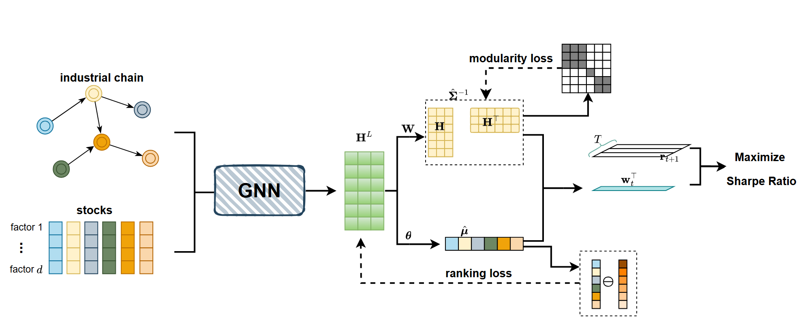

## Tangency Portfolios Using Graph Neural Networks

we present a method that employs Graph Neural Networks (GNNs) to estimate tangency portfolio weights by aggregating stock features based on the industry chain graph and using the aggregated features to estimate the expected returns and the covariance matrix. In addition to incorporating additional industry information, we propose two strategies to enhance the efficiency of estimation: 

- Calculating the dynamic modularity of the stock relationship graph using aggregated node features and constraining the estimated correlations to exhibit a clustered structure by minimizing modularity.
-  Adding a historical ranking regularization to the expected returns.
  

